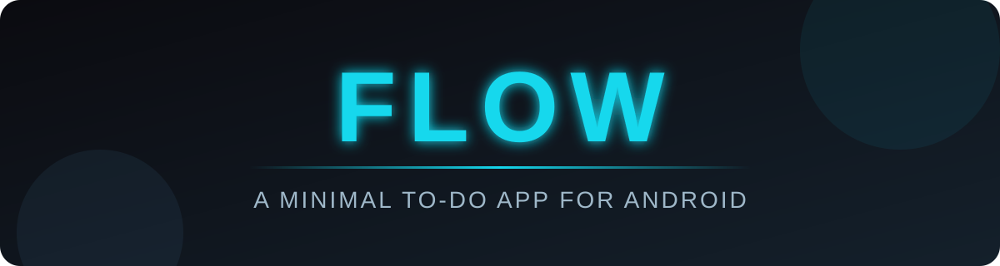

<p align="center">
  
</p>

<p align="center">
  
  
  
  
  
</p>

<p align="center">
  <b>Clean. Dark. Distraction-free.</b><br>
  Built with Kotlin and RecyclerView while learning Android development.
</p>

<p align="center"></p>

## 📱 Screenshots

<p align="center">
  
  &nbsp;&nbsp;&nbsp;&nbsp;
  
</p>

<p align="center"></p>

## ✨ Features

- 🔵 Smooth scrollable task list built with `RecyclerView`
- ☑️ Checkbox on every task
- 🧠 Ticks stay correct while scrolling (state lives in data, not in recycled views)
- 🌑 Dark theme with a cyan and blue accent
- 🔤 Custom header font and divider lines between tasks

<p align="center"></p>

## 🛠️ Built With

| Tool | Used for |
|---|---|
| **Kotlin** | App logic |
| **Android Studio** | Development |
| **RecyclerView** | Efficient scrolling list with custom Adapter and ViewHolder |
| **ConstraintLayout / LinearLayout** | Screen and row layouts |

<p align="center"></p>

## 🗂️ Project Structure

```
app/src/main/
├── java/com/malaika/flow/
│   ├── MainActivity.kt      # Sets up the RecyclerView and task list
│   └── flowcomp.kt          # RecyclerView adapter (ViewHolder + checkbox state)
└── res/layout/
    ├── activity_main.xml    # Screen layout: title + RecyclerView
    └── flow_comp.xml        # Single task row: checkbox + text + divider
```

## ⚙️ How It Works

1. `MainActivity` creates the task list and attaches a `LinearLayoutManager` and the `flowcomp` adapter to the RecyclerView.
2. `flowcomp` inflates `flow_comp.xml` for each visible row and reuses rows while you scroll.
3. The checked state of each task is kept in the adapter's data, so a recycled row never shows the wrong tick.

<p align="center"></p>

## 🚀 Getting Started

1. Clone the repository
   ```bash
   git clone https://github.com/<your-username>/Flow.git
   ```
2. Open the project in **Android Studio**
3. Let Gradle sync finish
4. Run the app on an emulator or a physical device

## 🧭 Roadmap

- [ ] Add new tasks with an input field and button
- [ ] Delete tasks
- [ ] Strikethrough text for completed tasks
- [ ] Save ticked tasks so they persist after the app closes
- [ ] Cloud sync with Firebase Firestore
- [ ] User login with Firebase Authentication

<p align="center"></p>

## 👩‍💻 Author

**Malaika**

## 📄 License

This project is licensed under the MIT License. See the [LICENSE](LICENSE) file for details.

<p align="center"><sub>Made with 💙 and Kotlin</sub></p>
